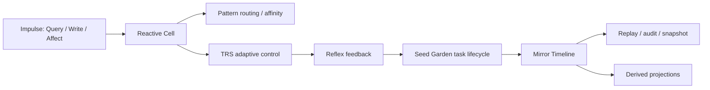

# Grant Evidence Package

Status: reviewer-facing evidence package.

Scope: this document summarizes the current LiminalDB artifact, reproducible reviewer path, evidence assets, explicit non-claims, and near-term research roadmap for grant reviewers.

## One-sentence claim

LiminalDB is an open-source Rust reactive storage and runtime substrate for adaptive systems that need replayable timelines, event-sourced state, reactive cells, feedback loops, and explainable transitions under changing load.

## Core idea

LiminalDB treats storage as active memory rather than passive CRUD.

```text
impulse -> reactive cell -> adaptive control / reflex -> mirror timeline -> replayable state transition
```

The goal is to support agentic and adaptive systems that need durable traces, live feedback, and auditable transition history.

## Reviewer path

A reviewer can validate the current Rust artifact locally:

```bash
cargo build --release -p liminal-cli
cargo test --workspace
```

Windows demo entrypoint:

```powershell
powershell -ExecutionPolicy Bypass -File .\scripts\demo-stack.ps1
```

Manual CLI start:

```bash
cargo build --release -p liminal-cli
./target/release/liminal-cli --store ./data --ws-port 8787
```

Expected local signs:

- CLI accepts commands such as `:status`, `:mirror top 10`, and `:snapshot`.
- WebSocket bridge logs local listening state.
- Mirror timeline exposes recent decisions/events.

## Architecture at a glance



LiminalDB is not only a database interface. It is closer to a reactive memory substrate for systems that need transitions, signals, and replayable state.

## Current evidence matrix

| Evidence asset | Reviewer question | Path / command | Current status |
| --- | --- | --- | --- |
| Rust workspace tests | Does the workspace validate core behavior? | `cargo test --workspace` | Implemented |
| Release build | Can the CLI be built locally? | `cargo build --release -p liminal-cli` | Implemented |
| Demo stack | Is there a reproducible stack demo? | `scripts/demo-stack.ps1`, `docs/STACK_DEMO.md` | Implemented |
| Architecture docs | Is the runtime architecture documented? | `docs/ARCHITECTURE_ANALYSIS.md`, `docs/` | Documented |
| Protocol docs | Is client-server communication specified? | `liminal-db/docs/PROTOCOL.md` | Documented |
| Benchmark baseline | Are performance measurements and caveats documented? | `docs/BENCHMARKS.md` | Documented baseline |
| Roadmap | Is active development direction explicit? | `docs/ROADMAP.md` | Documented |
| Origin note | Is the design motivation explained? | `docs/ORIGIN.md` | Documented |
| Grant materials | Are prior funding materials present? | `grants/` | Present |

## What is already implemented

- Rust core/runtime with cell, impulse, reflex, and adaptive-control concepts.
- CLI entrypoint.
- WebSocket protocol surface and TypeScript SDK path.
- Mirror Timeline for append-only event/replay orientation.
- Seed Garden task lifecycle.
- Journal, snapshot, and WAL-oriented storage components.
- Protocol documentation.
- Stack demo path and troubleshooting docs.
- Workspace test command.
- Initial benchmark baseline with caveats.
- Review links for architecture, benchmark baseline, release compatibility, security, roadmap, and grants.

## Implemented vs measured vs target claims

| Category | Meaning | Current handling |
| --- | --- | --- |
| Implemented | Code paths or docs currently present in the repository | Core runtime, CLI, WebSocket, SDK path, Mirror Timeline, Seed Garden, docs |
| Measured baseline | A concrete run or sample with reproducible caveats | `docs/BENCHMARKS.md` |
| Design target | Desired future performance or reliability goal | Performance Targets section in README |
| Roadmap | Planned or in-progress work | Distributed cluster/Raft, OpenTelemetry tracing, broader benchmark validation, security audit |

Grant/reviewer language should avoid presenting design targets as verified production claims.

## What LiminalDB makes inspectable

LiminalDB is designed to make adaptive-system behavior inspectable, including:

- what impulses entered the system,
- which cells reacted,
- how adaptive control changed behavior,
- which reflexes fired,
- what task lifecycle state changed,
- what was written to the Mirror Timeline,
- how state can be replayed or reconstructed through append-only history.

## What this project does not claim yet

LiminalDB currently does not claim:

- production-grade distributed consensus,
- production security audit completion,
- verified production benchmarks across hardware profiles,
- replacement of Postgres/Redis/Kafka for all workloads,
- certified compliance or data-governance guarantees,
- full agent memory solution by itself,
- universal database superiority,
- stable pre-1.0 API compatibility.

The current value is narrower: a working Rust reactive storage/runtime artifact with replay-oriented memory concepts, demos, tests, documentation, and benchmark baselines.

## Why this is grant-relevant

Agentic systems need memory substrates that preserve more than latest state. Safety and oversight workflows need traces, transitions, snapshots, replay, and derived projections.

LiminalDB contributes one infrastructure primitive:

```text
reactive state + append-only timeline + adaptive feedback + replayable transitions
```

This can support downstream evaluation, audit, and agent-memory experiments where state changes must remain inspectable.

## Research / build roadmap

Near-term grant-funded work can focus on:

1. **Trace/evidence storage profile** — define how LiminalDB stores trace records, decisions, and evidence artifacts without mutating ground truth.
2. **Replay fidelity** — validate that Mirror Timeline records can rebuild derived projections consistently.
3. **Benchmark hardening** — expand measured baselines across hardware, workloads, and comparison systems.
4. **OpenTelemetry integration** — connect runtime events to standard observability tools.
5. **Security model** — document threat model, audit boundary, and safe deployment assumptions.
6. **Adapter surface** — integrate with PythiaLabs, DRP, LTP, and CML artifacts as an evidence substrate.
7. **API stabilization** — clarify pre-1.0 compatibility and migration expectations.

## Relationship to DRP, PythiaLabs, LTP, and CML

LiminalDB answers a different question from the protocol/evidence gates:

- **LiminalDB:** Where can adaptive state, timelines, snapshots, and replayable events live?
- **DRP:** What decision was made, why, and how does it link to prior/later decisions?
- **PythiaLabs:** Should a proposed high-risk agent action be allowed, blocked, or escalated before tools are called?
- **LTP:** Was an agent execution path inspectable, replayable, anchored, and admissible?
- **CML:** Was an action causally valid under authorization, intent, and responsibility lineage?

Together they form complementary layers:

```text
LiminalDB stores replayable state and timelines
DRP records decisions
PythiaLabs gates proposed actions
LTP inspects execution traces
CML audits causal lineage
```

## Suggested grant reviewer checklist

A reviewer can ask:

- Can I build and test the workspace locally?
- Can I run a demo path and inspect timeline output?
- Are measured baselines separated from targets?
- Are non-claims explicit?
- Is the storage/evidence substrate role clear?
- Is there a plausible path from current runtime to trace/evidence infrastructure?

## Current strongest positioning

Use this formulation in applications:

```text
LiminalDB is an open-source Rust reactive storage and runtime substrate for adaptive systems that need replayable timelines, event-sourced state, feedback loops, and explainable transitions under changing load.
```
